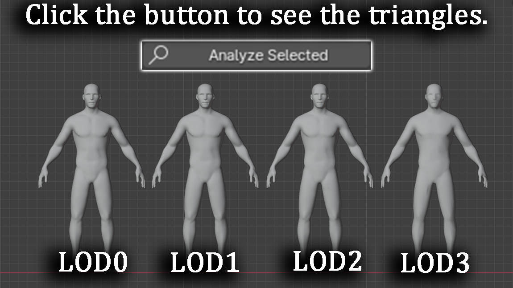
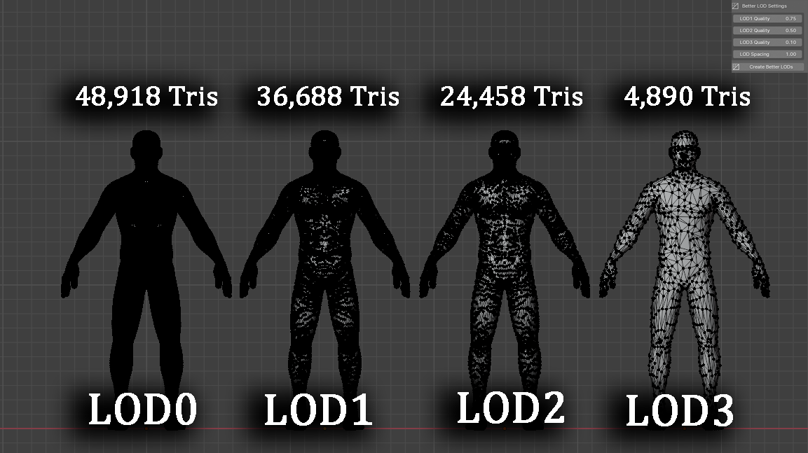

# GameReady Optimizer

<p align="center">
  <a href="showcase_result.png">
    
  </a>
</p>

<p align="center">
<i>Click the image to see the result</i>
</p>

<p align="center">
Optimize Blender models for Unity & Unreal Engine with smart LOD generation.
</p>

<p align="center">


</p>


---

## About

GameReady Optimizer is a Blender add-on designed to help game developers optimize 3D models for game engines.

It allows you to analyze meshes, create smart LODs, and safely optimize models while keeping the workflow simple.

Perfect for:

- Unity projects
- Unreal Engine projects
- Environment assets
- Props
- Characters
- Large scenes

---

## Features

### Smart LOD Generation
Automatically creates:

```text
LOD0
LOD1
LOD2
LOD3
```

### Safe Optimize
Safely performs:

```text
Apply Rotation
Apply Scale
Fix Normals
Remove Loose Vertices
Remove Empty Material Slots
```

### Low Poly Detection
Warns you when an object is already low poly.

---

## Example Result

<p align="center">
  
</p>

Example:

```text
48,918 triangles → 4,890 triangles
```

while still preserving the overall shape.

---

## Installation

1. Download the `.py` file

2. Open Blender

```text
Edit → Preferences → Add-ons → Install
```

3. Select:

```text
gameready_optimizer.py
```

4. Enable the add-on

5. Open:

```text
N Panel → GameReady
```

---

## How To Use

1. Select your mesh object

2. Click:

```text
Analyze Selected
```

3. Adjust:

```text
LOD1 Quality
LOD2 Quality
LOD3 Quality
LOD Spacing
```

4. Click:

```text
Create Better LODs
```

---

## Future Updates

More optimization features and workflow improvements are planned.

---

## License

This project is licensed under the MIT License.

---

## Author

Created by **Kuzey Kayra Eyioğlu**

---

## Connect With Me

<p align="center">
  <a href="https://github.com/KuzeyKayraEyioglu">
    
  </a>
  
  <a href="https://www.youtube.com/@KuzeyKayraEyio%C4%9Flu">
    
  </a>
</p>

<p align="center">
  <a href="https://github.com/KuzeyKayraEyioglu">GitHub</a>
  &nbsp;&nbsp;&nbsp;&nbsp;&nbsp;&nbsp;
  <a href="https://www.youtube.com/@KuzeyKayraEyio%C4%9Flu">YouTube</a>
</p>
